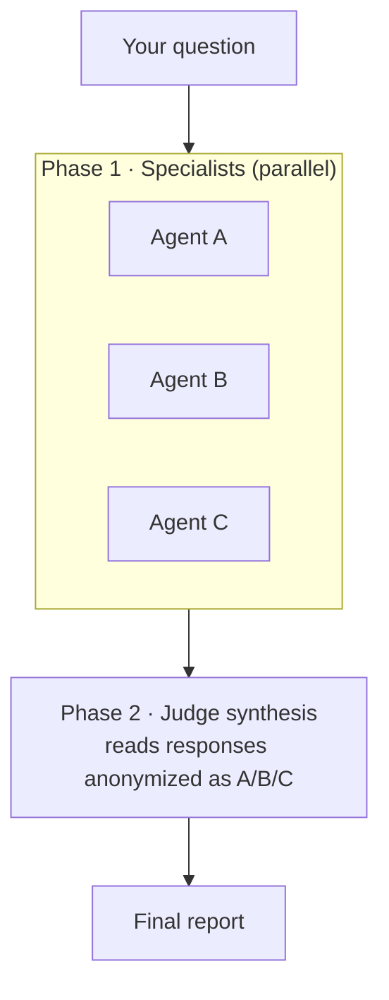
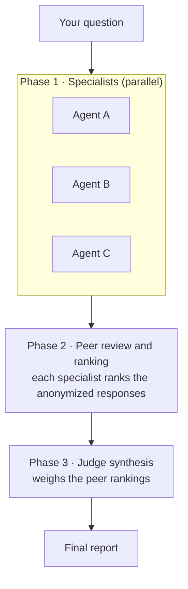
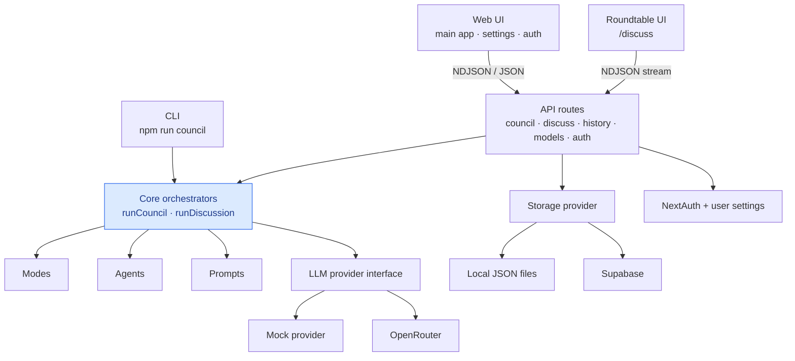

# 🏛️ Multi-Agent LLM Council

A deliberation system where multiple AI agents collaborate to answer your questions — each bringing a unique perspective, then synthesizing their insights into a single, balanced response.


## 🚀 Live Demo

**Try it now → [multi-agent-llm-council.onrender.com](https://multi-agent-llm-council.onrender.com)**

The demo runs on the deterministic mock provider, so you can explore the full council flow end-to-end without an API key.

> ℹ️ Hosted on Render's free tier — the first request after a period of inactivity may take ~30–60s while the service wakes up.

## How It Works

Every council mode runs the same engine. By default it's a **two-phase** flow. Optionally — via the **🔍 Run with Peer Review** button — it adds a middle peer-review/ranking phase, making it **three phases**. Peer review is a per-run analysis option, not a separate mode: it works with whichever mode you pick.

### Standard analysis (two phases)



### Peer Review analysis (three phases)



## Council Modes

| Mode                  | Best For                                                      |
| --------------------- | ------------------------------------------------------------- |
| **Decision Council**  | Weighing options, making choices                              |
| **Idea Council**      | Evaluating ideas and concepts                                 |
| **Critical Review**   | Reviewing text, arguments, proposals                          |
| **Learning Council**  | Understanding new concepts                                    |
| **Technical Council** | Architecture and code decisions                               |
| **Answer Council**    | Direct well-reasoned answers                                  |
| **SWOT Council**      | Strategic strengths/weaknesses/opportunities/threats analysis |

## Key Features

- **7 council modes** with purpose-built agent configurations, including a dedicated SWOT workflow
- **Optional peer review** — a one-click analysis that adds an anonymized peer-review/ranking phase before the judge, available for any mode
- **Customizable agents** — edit names, roles, prompts, or swap in agents from other modes
- **Per-agent and preferred model selection** — pick models per agent or constrain runs to a user-level allow-list
- **Live progress + cancellation** — watch specialist/judge progress stream in real time and stop a run mid-flight
- **Enable/disable agents** — run with fewer agents for faster results
- **Transparent process** — inspect every specialist's raw response and the judge's synthesis
- **Structured reports** — summary, conclusions, agreements, disagreements, risks, recommendations
- **Saved history + export** — logged-in users can save, reload, delete, copy, print to PDF, and export sessions
- **Roundtable discussions** — a separate live multi-agent discussion flow at `/discuss` for sequential debate
- **CLI support** — run councils from the terminal with the same core engine, plus JSON, file-input, peer-review, and mode-listing options
- **Graceful degradation** — continues working even if some agents fail

## Reviewer Quick Start

Want to evaluate the project in five minutes, without an API key? This path works on a fresh clone:

```bash
git clone https://github.com/Freudenberger/multi-agent-llm-council.git
cd multi-agent-llm-council
npm install
cp .env.example .env.local      # LLM_PROVIDER=mock is the default — no key required
npm run dev                     # open http://localhost:3000
```

In the UI: type a question → pick a mode → click **Run Council Analysis**. The mock provider returns deterministic responses so the full Phase 1 → Phase 2 flow (parallel specialists → judge synthesis) runs end-to-end. No external calls are made.

You can also exercise the same engine from the terminal:

```bash
npm run council -- --mode decision "Should I learn Rust or Go?"
```

To run the test suites:

```bash
npm test                                  # Vitest (unit + integration)
npm run typecheck                         # TypeScript
npm run lint                              # ESLint
npm --prefix tests/e2e install            # one-time Playwright install
npm run test:e2e                          # Playwright E2E
```

## Quick Start (with real LLM)

### Prerequisites

- Node.js 18+
- An [OpenRouter](https://openrouter.ai) API key

### Installation

```bash
git clone https://github.com/Freudenberger/multi-agent-llm-council.git
cd multi-agent-llm-council
npm install
cp .env.example .env.local
# Edit .env.local:
#   LLM_PROVIDER=openrouter
#   OPENROUTER_API_KEY=sk-or-...
```

### Run the Web App

```bash
npm run dev
```

Open [http://localhost:3000](http://localhost:3000).

### Run from CLI

```bash
npm run council -- --mode decision "Should I learn Rust or Go?"
```

For the full CLI surface area (`--peer-review`, `--input-file`, `--json`, `--list-modes`), see [src/cli/README.md](src/cli/README.md).

### Run Tests

```bash
npm test
```

## Docker

The app ships as a self-contained image built from the multi-stage [Dockerfile](Dockerfile) (Next.js `standalone` output, runs non-root). Run it locally:

```bash
docker build -t llm-council .
docker run --rm -p 3000:3000 \
  -e LLM_PROVIDER=mock \
  -e DB_PROVIDER=local \
  -e AUTH_SECRET=please-change-me \
  llm-council
# health check:
curl http://localhost:3000/api/health   # → {"status":"ok",...}
```

`/api/health` is a dependency-free liveness probe (no DB / LLM / auth) used by the container `HEALTHCHECK` and the CI smoke tests.

Two **manually-triggered** (`workflow_dispatch`) GitHub Actions back the image:

- **[Docker Build & Push](.github/workflows/docker-build.yml)** — builds the image, smoke-tests it (runs the container + curls `/api/health`), and **only pushes to Docker Hub if the test passes**.
- **[Docker Image Smoke Test](.github/workflows/docker-smoke.yml)** — pulls the published image back from Docker Hub, runs it, and curls `/api/health` to verify the artifact that actually shipped.

Required repo secrets (Settings → Secrets and variables → Actions): `DOCKERHUB_USERNAME`, `DOCKERHUB_TOKEN`.

### Versioning & releasing

`package.json` is the single source of truth for the image version. Each build is tagged three ways:

| Tag                        | Meaning                             |
| -------------------------- | ----------------------------------- |
| `latest`                   | newest build of the default branch  |
| `<version>` (e.g. `0.1.0`) | the `package.json` version          |
| `sha-<short>`              | the exact commit (always immutable) |

Releases are driven by **Conventional Commits** via [`commit-and-tag-version`](https://github.com/absolute-version/commit-and-tag-version). The bump level is derived from commit history — no manual choosing:

| Commit type                   | Bump  |
| ----------------------------- | ----- |
| `fix: …`                      | patch |
| `feat: …`                     | minor |
| `feat!:` / `BREAKING CHANGE:` | major |

> **One-time:** `feat → minor` only applies once the project is `≥ 1.0.0`. Below that, the preset treats every `feat` as a patch. Bootstrap to a stable major once, then it's fully automatic:
>
> ```bash
> npm run release -- --release-as major   # 0.1.0 → 1.0.0 (do this once, after committing pending work)
> ```

To cut a release after that:

```bash
npm run release            # reads commits, bumps package.json + package-lock, writes CHANGELOG.md, tags v<version>
npm run release:dry        # preview the bump + changelog without writing anything
git push --follow-tags
# then run the "Docker Build & Push" workflow → publishes llm-council:<version> + latest
```

`npm run release` makes the commit + tag for you, so cut a release for each meaningful change — that keeps the `<version>` image tag immutable per release (a manual build without a release overwrites the existing `<version>` tag with current `main`; the `sha-<short>` tag is always unique regardless).

## Architecture

The project is a **modular monolith** — a single deployable Next.js application with clear internal boundaries. The main council UI, the live roundtable UI, and the CLI all drive shared core modules; those cores depend on provider/storage/auth seams, never on React components:



The internal module layout:

```
src/
├── agents/          # Agent templates and persona registries
├── app/             # Next.js UI, routes, providers, pages, API handlers
├── auth/            # Auth.js config, user storage, BYOK/provider overrides
├── cli/             # Command-line interface
├── core/            # Shared orchestration engines
│   ├── runCouncil.ts   # Specialists → optional peer review → judge
│   ├── runDiscussion.ts # Live roundtable discussion orchestrator
│   ├── types.ts        # Shared run/result/progress types
│   ├── errors.ts       # Error taxonomy
│   └── logger.ts       # Structured logging
├── modes/           # Council mode registry
├── prompts/         # Prompt builders for council + discussion flows
├── providers/       # LLM provider abstraction + implementations
└── storage/         # Conversation/discussion persistence backends
```

The **core module** (`src/core/`) contains all deliberation logic and is fully independent from the UI. Both the web app and CLI consume it through the same `runCouncil()` function.

## Tech Stack

- **Framework:** Next.js 16 (App Router)
- **UI:** React 19, Tailwind CSS 4
- **Language:** TypeScript 5 (strict)
- **Validation:** Zod 4
- **Auth:** NextAuth 5 (Auth.js)
- **Persistence:** Local JSON or Supabase via provider abstractions
- **Testing:** Vitest
- **LLM Provider:** OpenRouter (access to 100+ models)

## Project Structure

```
llm-council/
├── council-core/        # Published npm package (core engine)
├── docs/                # Architecture decisions, PRD, feature docs
├── src/
│   ├── agents/          # Agent template definitions
│   ├── app/
│   │   ├── api/         # Council, discuss, auth, models, health, version
│   │   ├── components/  # React components (Markdown, AgentCustomizer, Footer)
│   │   ├── discuss/     # Live roundtable discussion page
│   │   ├── settings/    # User settings (preferred models, keys)
│   │   └── page.tsx     # Main council page
│   ├── auth/            # Auth/session and per-user provider configuration
│   ├── cli/             # CLI entry point
│   ├── core/            # Council + discussion engines, types, errors
│   ├── modes/           # Mode definitions (decision, idea, swot, etc.)
│   ├── prompts/         # Specialist, judge, and discussion prompt builders
│   ├── providers/       # OpenRouter provider + mock for tests
│   └── storage/         # Local JSON and Supabase persistence backends
├── tests/               # Vitest test suite
└── tests/e2e/           # Playwright end-to-end tests
```
