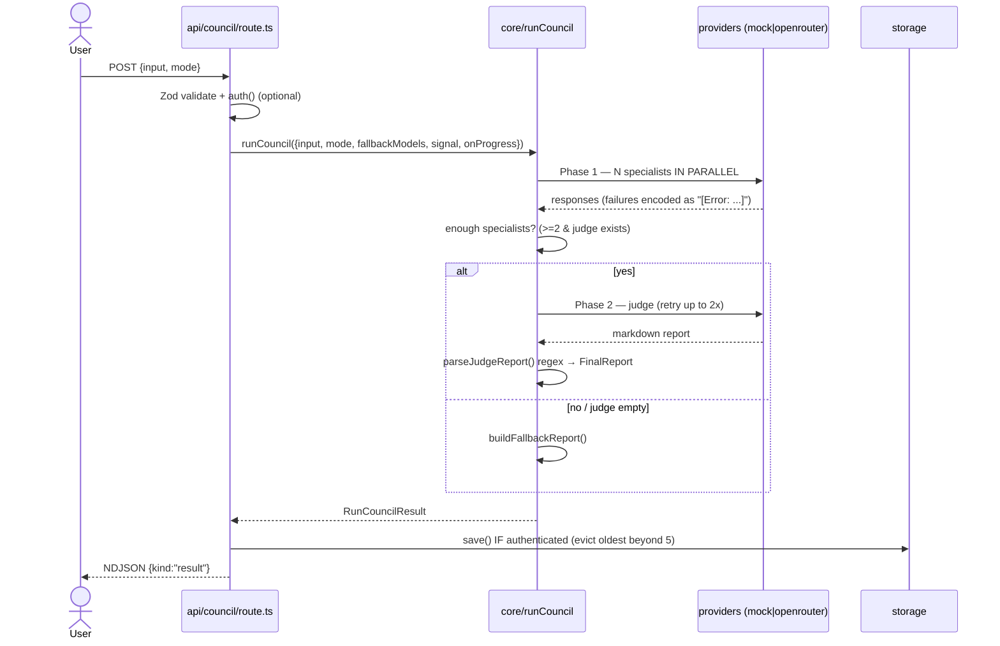
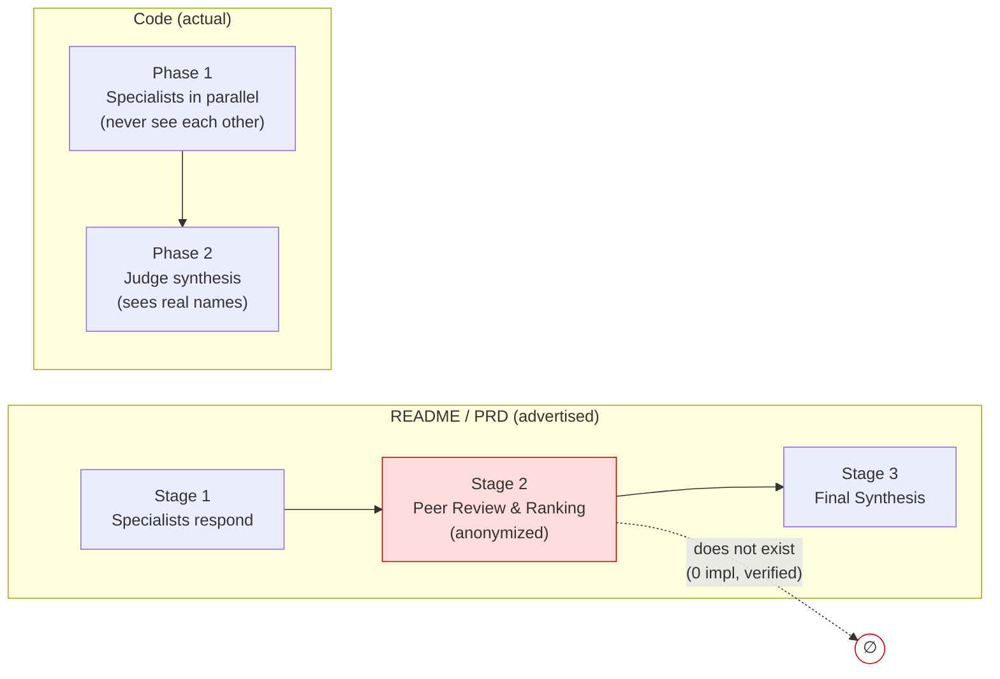

# Research — The Council Run Pipeline

**Artifact:** L3 (10xArchitect path) · **Change-id:** `council-pipeline-analysis` · **Date:** 2026-06-15
**Prior:** [context/map/repo-map.md](../../map/repo-map.md) — the map flagged `runCouncil.ts`, the prompt contract, and the storage authorization seam as risk zones. This research drills into the single most central flow: **what happens when a user runs a council.**

> **⚠️ Update — 2026-06-30 (post-analysis):** This L3 research is a **2026-06-15 snapshot**. Its top finding (D1) — that the advertised "Stage 2 / peer review" had **zero implementation** — was **subsequently closed**: peer review now runs as an **optional Phase 1.5** (`runPeerReview` [runCouncil.ts:418](../../../src/core/runCouncil.ts#L418); `buildPeerReview*` in [buildPrompts.ts](../../../src/prompts/buildPrompts.ts); tested in [runCouncil.test.ts](../../../tests/core/runCouncil.test.ts)). Passages below calling it "vaporware"/"absent" reflect the 06-15 state, not current code.
>
> **Intent:** Understand how the council run *actually* works end-to-end and name the technical debt on that path. Exploration only — no code changes, no refactor decision (that is L4).
>
> **Evidence legend:** `[E]` evidence (read at file:line) · `[I]` inference · `[U]` unknown/gap. Counts marked `(verified: sg)` were confirmed structurally with **ast-grep 0.43.0**; `(verified: rg)` with ripgrep. The dependency facts come from **madge 8.0.0**.

---

## Feature overview

This is a **flow, not a file list.** A council run is the product's one core action.

**End-to-end trace:**

1. **Entry.** Client POSTs `{input, mode, customAgents?}` to [api/council/route.ts:110](../../../src/app/api/council/route.ts#L110). A `runId` is minted and bound to a child logger `[E: route.ts:114-115]`.
2. **Validate.** Zod parses the body; `mode` must be one of 7 enum values `[E: route.ts:26-41]`. Bad JSON → 400 before validation `[E: route.ts:120-131]`.
3. **Resolve user (optional).** `auth()` is called; **if** signed in, the user's `preferredModels` become `fallbackModels` `[E: route.ts:157-162]`. Anonymous users still get a full run — auth gates *persistence*, not *execution*.
4. **Stream opens.** A `ReadableStream` emits **NDJSON** (not SSE), one tagged object per line: `{kind:"progress"}`, `{kind:"result"}`, `{kind:"error"}` `[E: route.ts:164-183, 254-260]`. A client disconnect aborts the run via `AbortController` `[E: route.ts:171-173, 248-251]`.
5. **Orchestrate** — [runCouncil():607](../../../src/core/runCouncil.ts#L607):
   - Load mode → **merge custom agents** (disabled ones filtered out) → **normalize judges** (keep first, demote extras) → **apply fallback models** (random model per agent with no explicit model) `[E: runCouncil.ts:630-636]`.
   - **Phase 1 — specialists** run **in parallel** via `Promise.all` `[E: runCouncil.ts:398-411]`. Each is told explicitly *not* to see the others `[E: buildPrompts.ts:36]`.
   - **Phase 2 — judge.** Skipped unless a judge exists **and** ≥2 specialists succeeded `[E: runCouncil.ts:448]`. Judge output is parsed and, if empty/errored, retried up to 2× with exponential backoff `[E: runCouncil.ts:501-527]`; on exhaustion a **fallback report** is built from raw specialist text `[E: runCouncil.ts:531-545, 567-603]`.
6. **Persist (optional).** If signed in, the result is saved with a derived title `[E: route.ts:205-218]`. The save enforces `MAX_CONVERSATIONS_PER_USER = 5`, evicting the oldest `[E: config.ts:13, localStorage.ts:76]`.
7. **Return.** `{kind:"result", result}` is the final line; the client renders specialists + final report.

**Advertised flow vs. actual flow** — the single most important picture in this report:

**Behaviour that surprised me (the things you would not guess from the file names):**

- **There is no "Stage 2 / peer review".** `[E]` The README ([README.md:23-25](../../../README.md#L23)) advertises *"Stage 2: Peer Review & Ranking — Agents evaluate each other's responses (anonymized to prevent bias)"* and offers to let you *"inspect every agent's... peer evaluation"* ([README.md:52](../../../README.md#L52)). **The code has two phases only** (specialists → judge). A grep for `peer|ranking|stage 2|evaluate each` across `src/` returns **only de-anonymization comments, zero implementation** *(verified: rg)*. The advertised Stage 2 is vaporware. This is the single highest-value finding on this path.
- **The judge is NOT anonymized — but the code comments say it is.** `[E]` [runCouncil.ts:481-482](../../../src/core/runCouncil.ts#L481) comments that the prompt labels specialists "Response A/B/C"; the actual prompt labels them by **real name and role**: `### ${r.agentName} (${r.role})` ([buildPrompts.ts:157](../../../src/prompts/buildPrompts.ts#L157)). The anonymization the README leans on doesn't exist anywhere.
- **`confidence` is fake.** `[E]` Every successful specialist gets a hardcoded `confidence: 4` ([runCouncil.ts:336](../../../src/core/runCouncil.ts#L336)), failures `1` ([:375](../../../src/core/runCouncil.ts#L375)), Supabase reload `3` ([supabaseStorage.ts:122](../../../src/storage/supabaseStorage.ts#L122)). It is never computed from anything, yet it is surfaced in the UI as if meaningful. *(verified: rg — only 3 assignment sites)*
- **Failure is a string, not a type.** `[E]` A failed agent returns content prefixed `"[Error: ...]"` (produced once, [runCouncil.ts:374](../../../src/core/runCouncil.ts#L374)); success/failure is then re-derived by `.startsWith("[Error:")`. ast-grep counts **8** such call-sites in `runCouncil.ts` *(verified: sg — `$A.startsWith("[Error:")` → 8)*; the **9th lives in the client** ([page.tsx:690](../../../src/app/page.tsx#L690), tsx) — so the producing string and its 9 detectors are coupled across the API boundary with no shared type.
- **Anonymous users get full runs.** `[I→E]` Auth only gates the `storage.save()` block ([route.ts:205](../../../src/app/api/council/route.ts#L205)); the run itself executes for anyone who can POST. Combined with no rate limit, the most expensive endpoint is open.

---

## Technical debt

Specific brittleness on this path — each item is named by its **consequence**, **what's missing to catch it**, and its **blast radius**. Distinguished into *true debt* (silent divergence) vs *cheap debt* (mechanical, CI-catchable).

### TRUE debt (silent, no guard)

**D1 — Doc-vs-code: the missing "Stage 2 peer review".** `[E]` _**[Closed 2026-06-30: implemented as optional Phase 1.5 — see update banner at top.]**_
- *Consequence:* the README, PRD framing, and architecture story promise a deliberation step (anonymized peer ranking) that does not run. A reviewer/grader following the docs looks for behaviour that isn't there; a future contributor may "fix" the orchestrator to match a stage that was never built.
- *Missing:* either the feature, or honest docs. No test asserts a peer-review step (none can — it doesn't exist).
- *Blast radius:* docs (README, PRD), the UI claim of inspectable "peer evaluation", and any roadmap built on the 3-stage model.
- *Coupling type:* **connascence of meaning** between docs and code, held together by nothing.

**D2 — Authorization by convention, not by contract.** `[E]` _**[✅ Closed 2026-06-30:** the ownership invariant now lives in the contract — `getOwned(id, userId)` ([storage/types.ts:40](../../../src/storage/types.ts#L40)), both route sites migrated, raw `get()` internal-only. See [refactor-opportunities/plan.md](../refactor-opportunities/plan.md).**]**_
- *Consequence:* `StorageProvider.get(id)` takes **no `userId`** ([storage/types.ts:30](../../../src/storage/types.ts#L30)); it returns *any* user's conversation. Ownership is enforced only by a manual comparison in the route, and the two call-sites guard **differently**: GET does `if (conversation.userId !== session.user.id)` ([route.ts:30](../../../src/app/api/conversations/[id]/route.ts#L30)) while DELETE does `if (conversation && conversation.userId !== ...)` ([route.ts:61](../../../src/app/api/conversations/[id]/route.ts#L61)). A third caller that forgets the check is an IDOR breach.
- *Missing:* the ownership invariant in the **type signature**. (A regression *test* exists — [tests/e2e/tests/idor.spec.ts](../../../tests/e2e/tests/idor.spec.ts) — so the current two sites are guarded, but the seam invites the next mistake.)
- *Blast radius:* every present and future consumer of `storage.get()` *(verified: rg — 2 call-sites today, both in `[id]/route.ts`)*.
- *Coupling type:* **connascence of convention across a distance** — the rule lives in the caller's head, not the contract.

**D3 — The judge contract is a prose↔regex handshake.** `[E]`
- *Consequence:* `buildReportJudgeSystemPrompt` defines the report as Markdown headings ([buildPrompts.ts:103-145](../../../src/prompts/buildPrompts.ts#L103)); `parseJudgeReport` reconstructs the `FinalReport` by regex-matching those exact headings ([runCouncil.ts:188-251](../../../src/core/runCouncil.ts#L188)). Rename a heading in one place and the other silently yields empty sections — which the truncation heuristic may then misread as "truncated, confidence ≤2" ([runCouncil.ts:232-249](../../../src/core/runCouncil.ts#L232)).
- *Missing:* a structured output contract (schema/JSON) or at least a test pinning heading↔parser alignment for every mode.
- *Blast radius:* the product's primary artifact (the report) for all report-style modes.
- *Coupling type:* **connascence of value + algorithm** between two files with no compiler link.

### CHEAP debt (mechanical, low blast radius)

**D4 — Dead mode-id case.** `[E]` `buildJudgeSystemPrompt` has `case "critical-review":` ([buildPrompts.ts:55](../../../src/prompts/buildPrompts.ts#L55)) but the id is `"criticalReview"` ([types.ts:6](../../../src/core/types.ts#L6)); the case is unreachable. Behaviourally harmless (falls through to the same default) but it's a latent value-mismatch and a misleading signal. A guard/test fixes it; not a refactor.

**D5 — `swot` mode is half-wired.** `[E]` `swot` is a valid id (type, route enum, registry) but `MODE_DESCRIPTIONS` in [buildPrompts.ts:3-15](../../../src/prompts/buildPrompts.ts#L3) has **no `swot` entry**, so SWOT specialists get the generic *"multi-perspective analysis council"* framing ([buildPrompts.ts:27](../../../src/prompts/buildPrompts.ts#L27)) and no SWOT-specific judge prompt. Works, but thinner than the named modes.

**D6 — `confidence` theatre.** `[E]` (see overview) Hardcoded `4/1/3`. Cheap to remove or honestly compute; misleads users today.

---

## Map corrections & unknowns

- **Map correction:** the repo-map and the older [docs/tmp/feature-analysis-report.md](../../../docs/tmp/feature-analysis-report.md) inherited the README's "3-stage / Phase 1 → Phase 2" framing. **Corrected here:** the implementation is **2 phases**; the README's "Stage 2" does not exist. `[E]`
- `[U]` **Streaming under real providers:** progress events are emitted, but whether `openrouter` streams token-by-token or only phase-boundary events under load was not exercised (mock provider only). Unverified.
- `[U]` **Supabase eviction concurrency:** `MAX_CONVERSATIONS_PER_USER` eviction ([localStorage.ts:76](../../../src/storage/localStorage.ts#L76), [supabaseStorage.ts:174](../../../src/storage/supabaseStorage.ts#L174)) was read but not tested under concurrent saves; a race could over- or under-evict. Unverified.
- `[U]` **Cost/abuse:** no rate limit on the open `/api/council` was found; the dollar blast radius of the anonymous-run path is unquantified.

**Hand-off to L4:** the ranked refactor question is which of **D2 (authorization contract)** and **D3 (judge contract)** is worth fixing first, with **D1** treated as a separate product decision (build the stage vs. correct the docs).
