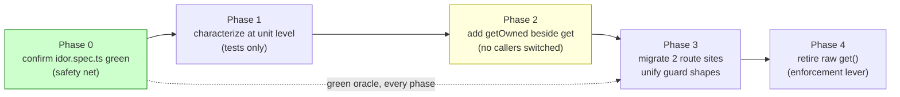

# Plan — Move authorization into the storage contract (D2)

**Artifact:** L4, planning stage (10xArchitect path) · **Change-id:** `refactor-opportunities` · **Date:** 2026-06-15
**Decision input:** [research.md](./research.md) ranked **D2 (authorization by convention)** #1.

> Plan only — no code in this document. Each phase is an independently reviewable, reversible commit that **lands green**.

> **✅ Executed — 2026-06-30.** This plan was subsequently **shipped**. All four phases are done: `getOwned(id, userId)` is on the `StorageProvider` (and `DiscussionStorageProvider`) contract and implemented in all backends ([storage/types.ts:40](../../../src/storage/types.ts#L40), [localStorage.ts](../../../src/storage/localStorage.ts), [supabaseStorage.ts](../../../src/storage/supabaseStorage.ts), [discussionStorage.ts](../../../src/storage/discussionStorage.ts)); both route sites use it with the unified `null → 404` shape ([conversations/[id]/route.ts](../../../src/app/api/conversations/[id]/route.ts)); raw `get()` is annotated internal/test-only and is no longer reachable from any route (verified: rg); and `getOwned` is unit-tested on both backends ([localStorage.test.ts](../../../tests/storage/localStorage.test.ts), [discussionStorage.test.ts](../../../tests/storage/discussionStorage.test.ts)) with [idor.spec.ts](../../../tests/e2e/tests/idor.spec.ts) green throughout. **D2 is closed** — analysis became a shipped improvement.

---

## Decision & scope

**Refactor:** make conversation ownership part of the **storage contract** instead of a convention every route caller must remember. Today `StorageProvider.get(id)` ([storage/types.ts:30](../../../src/storage/types.ts#L30)) returns any user's conversation, and ownership is re-checked at 2 route call-sites with **two different guard shapes** ([route.ts:30](../../../src/app/api/conversations/[id]/route.ts#L30), [:61](../../../src/app/api/conversations/[id]/route.ts#L61)). The next caller that forgets is a silent IDOR.

**Target shape:** an ownership-aware accessor — `getOwned(id, userId): Promise<StoredConversation | null>` — that returns `null` for both *not found* and *not owned* (indistinguishable to the caller, which closes the enumeration side-channel). Route handlers translate `null` → 404/403 in one consistent place. The raw `get(id)` is retired from route code via **Branch by Abstraction**.

### What we are NOT doing (explicit)
- **Not** implementing the missing "Stage 2 peer review" (D1) — separate product decision, routed to `/10x-roadmap`. _**[Update 2026-06-30:** that decision was since made and peer review shipped as optional Phase 1.5 — out of scope for *this* L4 plan, which is about the D2 authorization refactor.**]**_
- **Not** touching the judge prose↔regex contract (D3) — ranked #2, deferred.
- **Not** building the provider ACL (D7) — that's the L5 artifact.
- **Not** adding rate limiting or changing auth/session mechanics — out of scope.
- **Not** changing the persisted data shape or `MAX_CONVERSATIONS_PER_USER`.
- **No behavioural change** for legitimate users: an owner still gets 200, a stranger still gets 403/404, anon still 401. This refactor preserves behaviour and relocates *where* it's enforced.

---

## Safety net (characterization) — already present

The L4 rule is *"add the test before you touch the code."* Here it **already exists**: [tests/e2e/tests/idor.spec.ts](../../../tests/e2e/tests/idor.spec.ts) pins the current guarantee (owner 200, stranger 403, stranger absent from list, anon 401). **Phase 0 is simply to confirm it's green on `main`** and treat it as the regression oracle for every later phase. If any phase makes it red, the phase is wrong.

---

## Phases at a glance



Each box is one reviewable, reversible commit that lands green; the IDOR test is the regression oracle throughout.

## Phases (ordered, each lands green)

### Phase 1 — Characterize at the unit level *(guard-first, no production code change)*
- Add a focused storage-level test asserting today's semantics for **both** backends behind the contract: `get(id)` returns a conversation regardless of owner (documents the current gap), and the route returns 403 for a non-owner.
- **Verification:** new test passes; `idor.spec.ts` still green; `npm test` + `typecheck` + `lint` clean. No production code touched.
- *Reversible:* it only adds tests.

### Phase 2 — Introduce `getOwned` alongside `get` *(Branch by Abstraction — mechanism lands, no caller switched yet)*
- Add `getOwned(id, userId)` to the `StorageProvider` interface ([storage/types.ts](../../../src/storage/types.ts)) and implement it in **both** `localStorage` and `supabaseStorage` (Supabase can push the `userId` filter into the query; local filters in memory). Implement as: load by id, return it only if `userId` matches, else `null`.
- Keep `get(id)` exactly as-is. Nothing calls `getOwned` yet.
- **Verification:** new unit tests for `getOwned` (owner → row, non-owner → null, missing → null) pass on both backends; existing suite green. The new method is dead code at this point — intentionally, so it can be reviewed in isolation.
- *Reversible:* delete the new method.

### Phase 3 — Migrate the two route call-sites *(behaviour-preserving switch)*
- Replace `get(id)` + manual ownership check with `getOwned(id, session.user.id)` in **both** GET and DELETE ([conversations/[id]/route.ts](../../../src/app/api/conversations/[id]/route.ts)). Unify the two divergent guard shapes into one: `null → 404`, present → proceed. (Decide 403-vs-404 policy once and apply identically; `null`-collapses-both is the recommended default.)
- **Verification:** `idor.spec.ts` green **unchanged** (this is the proof the relocation preserved behaviour); GET/DELETE integration paths exercised; full suite + typecheck + lint clean.
- *Reversible:* revert the two handlers to the prior guard.

### Phase 4 — Retire raw `get(id)` from authenticated paths *(enforcement, separate lever)*
- Audit remaining `get(id)` callers *(today: only the 2 now-migrated route sites — verified by rg)*. If none remain in request-handling code, either remove `get` from the interface or annotate it as internal/test-only so a future contributor can't reach for the unguarded accessor by accident.
- **Verification:** rg shows zero `get(` call-sites outside storage internals/tests; suite green. Enforcement (removing the footgun) ships **after** the mechanism, so it can be rolled back independently.
- *Reversible:* re-export `get`.

---

## Before / after (the relocation made concrete)

**Before — ownership re-derived in the route, two shapes:**
```ts
// GET  conversations/[id]/route.ts:20,30
const conversation = await storage.get(id);
if (!conversation) return 404;
if (conversation.userId !== session.user.id) return 403;   // shape A

// DELETE conversations/[id]/route.ts:60,61
const conversation = await storage.get(id);
if (conversation && conversation.userId !== session.user.id) return 403;  // shape B (differs)
```

**After — ownership in the contract, one shape:**
```ts
// both GET and DELETE
const conversation = await storage.getOwned(id, session.user.id);
if (!conversation) return notFound();   // not-found and not-owned collapse to one path
// ...proceed; ownership is guaranteed by the type of the call
```

---

## Verification summary (per-phase gate)

| Phase | Auto gate | Manual gate |
| :---: | --------- | ----------- |
| 1 | `npm test` + `typecheck` + `lint` green; `idor.spec.ts` green | Review: tests document the *current* gap honestly |
| 2 | New `getOwned` unit tests green (both backends); suite green | Review the new method in isolation; confirm Supabase filters by `userId` server-side |
| 3 | **`idor.spec.ts` green unchanged**; suite green | Confirm 403/404 policy is identical across GET & DELETE |
| 4 | rg: 0 unguarded `get(` callers in route code; suite green | Confirm no public path can reach the raw accessor |

**Done when:** ownership is impossible to forget because the only accessor reachable from a route *requires* a `userId`, and `idor.spec.ts` passed unchanged through Phases 1→4.
