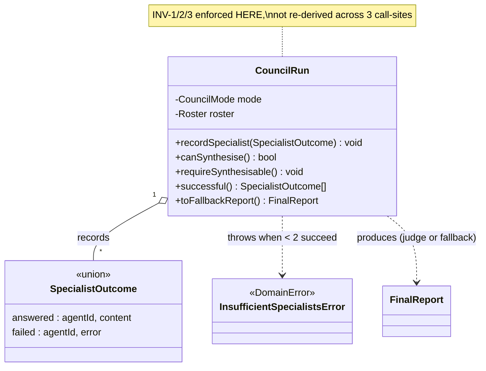

# Invariant & Aggregate — the CouncilRun

**Artifact:** L5 (10xArchitect path), doc 2 of 3 · **Date:** 2026-06-15
**Prior:** [01-domain-distillation.md](./01-domain-distillation.md). Diagnostic design — no code changes.

> This doc models the **core** domain object, `CouncilRun`. Its rules are *already enforced correctly* today, but procedurally — scattered across the 748-line orchestrator. Modelling it as an aggregate is about **clarity and a single enforcer**, not fixing a live bug (the live bug is the ownership invariant, handled in L4).

---

## Discovered invariants

| ID | Invariant | Core? | Routed? | Enforced? |
| -- | --------- | :---: | :-----: | --------- |
| **INV-1** | A run produces a **judge report** iff a judge exists **and** ≥`MIN_SPECIALISTS_FOR_JUDGE` (2) specialists succeeded; otherwise a **fallback report** | ✔ | medium | ✔ procedurally `[E: runCouncil.ts:448]` |
| **INV-2** | A run has **exactly one** judge (extra judges demoted to specialists; zero → fallback) | ✔ | low | ✔ `[E: runCouncil.ts:65-105]` |
| **INV-3** | A **disabled** agent never participates | ✔ | low | ✔ `[E: runCouncil.ts:55]` |
| **INV-4** | A specialist answers **independently** — never sees peers | ✔ (per current design) | low | ✔ `[E: buildPrompts.ts:36]` |
| **INV-5** | Specialists **peer-review anonymously** before judgment | — | — | **✘ declared only** (README); not in code — see [01](./01-domain-distillation.md) MC-1 |

---

## Chosen invariant: INV-1 (run validity → report vs fallback)

**Statement:** *A CouncilRun is complete with a judge-synthesised `FinalReport` only when a judge is present and at least two specialists produced non-error responses; in every other case it completes with a clearly-labelled fallback report.*

**Three-axis score:** (a) **core** — this rule defines what a "valid council result" even means; (b) **routed** — the decision is read in `runJudge` and re-derived again for logging/`canRunJudge` at [runCouncil.ts:708-710](../../src/core/runCouncil.ts#L708); (c) **enforcement** — correct but **implicit**: the `≥2` threshold, the "judge exists" check, and the "is this report empty?" check are spread across `runJudge`, `parseJudgeReport`, and `isReportEmpty`.

---

## Current-state diagnosis (where the rule lives)

- `MIN_SPECIALISTS_FOR_JUDGE = 2` constant `[E: runCouncil.ts:27]`.
- Gate decision: `if (!finalJudge || successfulSpecialists.length < MIN_SPECIALISTS_FOR_JUDGE) → fallback` `[E: runCouncil.ts:448]`.
- "Did the judge actually produce something?" re-derived via `isReportEmpty(parseJudgeReport(...))` in **two** places — the retry predicate `[E: runCouncil.ts:521-523]` and the post-retry check `[E: runCouncil.ts:531-534]`.
- The same validity is **re-computed a third time** for logging as `canRunJudge` `[E: runCouncil.ts:708-710]`.
- "Success" of a specialist is itself derived from the magic string `!content.startsWith("[Error:")` at 9 sites `[E: runCouncil.ts, verified rg → 10 incl. client]`.

So one domain rule is expressed as: a constant + three re-derivations + a string convention. Nothing crashes, but the rule has no **single home**.

---

## Aggregate design — `CouncilRun`

A diagnostic sketch (signatures, not implementation):

```ts
// Value objects make "success" a type, not a string convention (retires "[Error:")
type SpecialistOutcome =
  | { kind: "answered"; agentId: string; agentName: string; content: string }
  | { kind: "failed";   agentId: string; agentName: string; error: string };

// Aggregate root: owns the validity invariant in ONE place
class CouncilRun {
  constructor(
    private readonly mode: CouncilMode,
    private readonly roster: { specialists: CouncilAgent[]; judge?: CouncilAgent },
  ) {
    // INV-2/INV-3 enforced at construction: exactly one judge, no disabled agents
  }

  recordSpecialist(outcome: SpecialistOutcome): void;

  /** INV-1, in one guard clause. */
  canSynthesise(): boolean {
    return !!this.roster.judge
      && this.successful().length >= CouncilRun.MIN_SPECIALISTS_FOR_JUDGE;
  }

  /** Fail-fast: callers cannot synthesise an invalid run. */
  requireSynthesisable(): void {
    if (!this.canSynthesise()) throw new InsufficientSpecialistsError(this.successful().length);
  }

  successful(): SpecialistOutcome[]; // single definition of "answered"
  toFallbackReport(): FinalReport;   // the one place fallback is built
}
```

- **Named domain error** `InsufficientSpecialistsError` (and reuse of the existing `CouncilAbortedError` taxonomy in [core/errors.ts](../../src/core/errors.ts)) instead of string sniffing.
- **One enforcer:** `canSynthesise()` replaces the three re-derivations; `successful()` replaces the 10 `startsWith("[Error:")` sites.
- This is a **right-sized** change: the run logic is genuinely core, so it earns an aggregate; it is *not* a rewrite of the orchestrator's I/O, retry, or streaming.



---

## Before / after (per layer)

| Layer | Before | After |
| ----- | ------ | ----- |
| Orchestrator | `if (!finalJudge \|\| successful.length < 2)` inline; success via `startsWith("[Error:")` | `run.canSynthesise()` / `run.requireSynthesisable()`; success via typed `SpecialistOutcome` |
| Logging | `canRunJudge` re-computed at :708 | read `run.canSynthesise()` once |
| Client ([page.tsx:690](../../src/app/page.tsx#L690)) | `response.content.startsWith("[Error:")` | render off `outcome.kind === "failed"` |

---

## Test plan (cases, not code)

1. Judge present + 2 successful specialists → `canSynthesise() === true`; report is judge-synthesised.
2. Judge present + 1 successful (1 failed) → `canSynthesise() === false`; `requireSynthesisable()` throws `InsufficientSpecialistsError`; result is a fallback report labelled with the failure.
3. Zero judges after customization → fallback report; no throw.
4. Two judges configured → exactly one judge runs (INV-2); the other is treated as a specialist.
5. Disabled agent in `customAgents` → never appears in `successful()` (INV-3).
6. A specialist returns empty/garbage (not an error) → classified `answered` but the judge-empty path still yields a usable report or fallback (guards INV-1 against the parse heuristic).

> Note: this aggregate **does not** introduce peer review (INV-5). That remains a product decision (see [01](./01-domain-distillation.md) MC-1). The aggregate would, however, give peer review a clean home if it is ever built.
