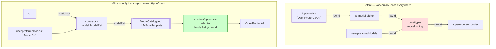

# Anti-Corruption Layer — the LLM provider boundary

**Artifact:** L5 (10xArchitect path), doc 3 of 3 · **Date:** 2026-06-15
**Prior:** [01-domain-distillation.md](./01-domain-distillation.md) classified LLM access as a **Supporting** subdomain. Diagnostic design — no code changes.

> **Evidence legend:** `[E]` file:line · `[I]` inference · counts *(rg)* verified with ripgrep.

---

## What is and isn't leaking (credit where due)

The provider boundary is **half-clean already**, and it's worth saying so before proposing an ACL:

- ✅ **The implementation class is contained.** `OpenRouterProvider` is imported **only** by the factory `providers/index.ts` *(madge: the sole inbound edge to `providers/openRouterProvider` is from `providers/index`; [providers/index.ts:3](../../src/providers/index.ts#L3))*. Core depends on the `LLMProvider` **port** ([providers/types.ts](../../src/providers/types.ts)), never the concrete class. That is exactly a Branch-by-Abstraction port done right.
- ❌ **The vocabulary leaks.** The OpenRouter **model-identifier string** (e.g. `"openrouter/free"`, `"anthropic/claude-..."`) is threaded through the domain as a bare `string`. `model`/`openrouter` appears across **18 files / 192 occurrences** *(rg)*, including core types, user preferences, the settings UI, and a `/api/models` route that fetches OpenRouter's catalogue.

So the leak isn't the *provider* — it's the *model concept*. The ACL targets that.

---

## Chosen leaky dependency: the OpenRouter model identifier

**Why this one** (by impact, not by surface):

| Signal | Evidence |
| ------ | -------- |
| Multi-layer presence (proves it leaked) | core domain (`CouncilAgent.model`, with the comment *"OpenRouter model identifier"* `[E: types.ts:21-22]`), user prefs (`preferredModels` `[E: auth/types.ts]`), UI (model picker in `AgentCustomizer.tsx` `[E]`), API (`/api/models` route fetches the OpenRouter catalogue `[E: app/api/models/route.ts]`) |
| Reconstructed in several places | the same "a model is just a string id" assumption is re-made in core, settings, and the models route — no single type carries it |
| Docs-vs-code tension | core types are meant to be UI/provider-independent ([docs/architecture.md](../../docs/architecture.md)), yet `types.ts` literally names "OpenRouter" in a comment `[E: types.ts:21]` |

---

## Current-state diagnosis (each layer touching the concept directly)

- **Domain** — `CouncilAgent.model?: string` and `CustomAgent.model?: string` carry a provider-format string into the core vocabulary `[E: types.ts:22,82]`.
- **Orchestrator** — `createProvider(model)` passes the raw string straight to the provider per agent `[E: runCouncil.ts:287]`.
- **User prefs** — `preferredModels: string[]` become the run's `fallbackModels` `[E: route.ts:160-161]`; a user's saved OpenRouter ids flow into core unmediated.
- **UI** — the model picker lists OpenRouter ids and writes them onto agents `[E: AgentCustomizer.tsx]`.
- **API** — `/api/models` shapes responses from OpenRouter's catalogue format `[E: app/api/models/route.ts]`.

The `model` string is thus a **connascence of meaning** spanning UI ↔ core ↔ provider ↔ persistence, with no type holding the format steady.

---

## The boundary, before and after



## ACL design (sketch — signatures only)

1. **Value object — `ModelRef`** (domain language, hides the format):
```ts
class ModelRef {
  private constructor(private readonly id: string) {}
  static parse(raw: string): ModelRef;   // validates provider-format once, here
  toProviderId(): string;                 // only the adapter calls this
  get label(): string;                    // domain/UI-facing display
}
```
2. **Port — model catalogue** (domain language, no OpenRouter shapes):
```ts
interface ModelCatalogue {
  list(): Promise<ModelRef[]>;            // replaces /api/models touching OpenRouter JSON
}
```
3. **Adapter — the only code that knows "OpenRouter"**:
```ts
// src/providers/openrouter/  (the single ACL home)
class OpenRouterModelCatalogue implements ModelCatalogue { /* maps OR catalogue → ModelRef[] */ }
// OpenRouterProvider.generate already accepts the id; it would take ModelRef.toProviderId()
```
- Core, prefs, and UI speak `ModelRef`; only `src/providers/openrouter/*` (and the existing `OpenRouterProvider`) ever see the raw id format or OpenRouter's catalogue JSON.

---

## Success criterion (checkable)

After the ACL, this must hold:

```
rg -n "openrouter|OpenRouter|/free|anthropic/claude" src/ \
  --glob '!src/providers/openrouter/**' --glob '!src/providers/openRouterProvider.ts'
# → zero matches
```

Today that search hits **18 files** *(rg, baseline)*; success = it hits **only** the adapter directory. The comment *"OpenRouter model identifier"* must disappear from [types.ts:21](../../src/core/types.ts#L21) — core should say `ModelRef`, not name a vendor.

---

## Before / after (per layer)

| Layer | Before | After |
| ----- | ------ | ----- |
| Domain | `model?: string // "OpenRouter model identifier"` | `model?: ModelRef` (vendor-neutral) |
| Orchestrator | `createProvider(model /* raw string */)` | `createProvider(model.toProviderId())` inside the provider seam |
| User prefs | `preferredModels: string[]` (OR ids) | `preferredModels: ModelRef[]` |
| API `/api/models` | returns OpenRouter catalogue shape | returns `ModelRef[]` via `ModelCatalogue` port |
| UI picker | lists raw OR ids | lists `ModelRef.label` |

---

## Right-sizing note

This is a **thin wrapper**, not a re-implementation of OpenRouter — `ModelRef` carries an id and a label; the adapter does the format/catalogue knowledge. It is genuinely *Supporting* subdomain work: worth doing for vendor-independence and to honour the architecture's Core-vs-provider rule, but **lower priority than the ownership invariant** (L4) which carries silent security risk. Recommended sequence: L4 ownership first, then this ACL, then the CouncilRun aggregate (doc 2) as clarity work.
