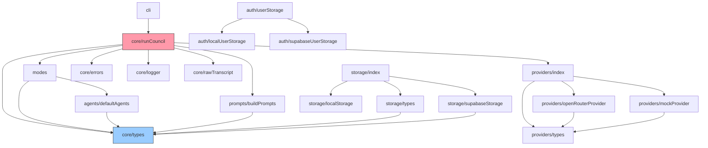

# Repo Map — Multi-Agent LLM Council

**Artifact:** L2 (10xArchitect path) · **Generated:** 2026-06-15
**Method:** `git log` history + **madge 8.0.0** dependency graph + **ast-grep 0.43.0** structural verification + targeted reads (see _Limitations_).

> **Evidence legend used throughout:** `[git]` = from commit history · `[graph]` = from import analysis · `[code]` = read & verified at `file:line` · `[inference]` = reasoning, not directly proven · `[unknown]` = data gap.

---

## TL;DR

The Multi-Agent LLM Council is a **modular monolith** (Next.js 16 + React 19 + TypeScript strict) that runs a user's question through several LLM "specialist" agents in parallel, then has a "judge" agent synthesise one structured report. The UI/API layer ([src/app/](../../src/app/)) is the busiest surface; the **domain heart is [src/core/runCouncil.ts](../../src/core/runCouncil.ts)** (748 lines, the orchestrator). `Core` is deliberately UI-independent and is reused by both the HTTP route and a CLI. Work concentrates in three places: the council orchestrator, the page/provider UI state, and the settings/auth surface. Where it _hurts_ is at three seams — the **LLM prompt contract**, the **provider boundary**, and the **storage authorization check** — plus one outright **documentation-vs-code divergence** (a "Stage 2 peer review" that the README advertises but the code never implements).

```
Browser ──HTTP/NDJSON──▶ app/api/council ──▶ core/runCouncil ──▶ providers (mock|openrouter)
                              │                     │                    │
                          auth/config          modes + agents      external LLM
                              │                  prompts
                          storage (local|supabase)
```

This map is for a young repo (37 commits, ~1 week). Read _Limitations_ before trusting the history signals — the time window is days, not years.

---

## Territory

**Scale:** ~8,500 lines of TS/TSX across `src/` `[code]`. 37 commits, 2026-06-08 → 2026-06-15 `[git]`. Two authors: `Krzysiek` (34 commits), `Freudenberger` (3) `[git]`.

**Deep modules (large responsibility):**

- `src/core/` — orchestration, types, logging, raw-transcript. The product logic.
- `src/app/` — Next.js App Router: pages, components, and all API routes. Largest by line count.
- `src/providers/` — LLM abstraction (mock + OpenRouter) with retry/timeout.

**Shallow / periphery:** `src/config.ts` (one constant), `src/cli/` (thin consumer of core), `src/modes/` + `src/agents/` (data/declarations more than logic).

**Where work concentrates** — top churn by commit count `[git]`:

| File                                                                           | Commits | Role                                        |
| ------------------------------------------------------------------------------ | :-----: | ------------------------------------------- |
| [src/app/page.tsx](../../src/app/page.tsx)                                     |   14    | Main UI surface (847 lines) — the state hub |
| [src/app/api/council/route.ts](../../src/app/api/council/route.ts)             |   11    | HTTP entry, NDJSON streaming, persistence   |
| [src/core/runCouncil.ts](../../src/core/runCouncil.ts)                         |   10    | The orchestrator                            |
| [src/core/types.ts](../../src/core/types.ts)                                   |    8    | Domain contract                             |
| [src/agents/defaultAgents.ts](../../src/agents/defaultAgents.ts)               |    6    | Agent templates / prompts                   |
| [src/app/api/user/settings/route.ts](../../src/app/api/user/settings/route.ts) |    5    | API-key/preferences management              |

The history is too short for quarterly trends; the signal it _does_ give is **where iteration churns**: UI state (`page.tsx`), the council contract (`runCouncil.ts` + `types.ts`), and the settings/auth surface.

---

## Real couplings

**Co-change pairs** (files changed in the same commit, `[git]`):

| Pair                                                   | Times | Reading                                                                                                                       |
| ------------------------------------------------------ | :---: | ----------------------------------------------------------------------------------------------------------------------------- |
| `api/user/settings/route.ts` ↔ `app/settings/page.tsx` |   3   | **Front/back contract for settings** — the form and its endpoint move together. Convention coupling across the HTTP boundary. |
| `api/council/route.ts` ↔ `app/page.tsx`                |   2   | **Front/back contract for the council run** — the NDJSON stream shape and its consumer move together.                         |
| `core/types.ts` ↔ `modes/index.ts`                     |   1   | Adding/renaming a mode touches the type union and the registry together.                                                      |
| `core/rawTranscript.ts` ↔ `core/runCouncil.ts`         |   1   | Transcript logging is woven into the orchestrator.                                                                            |

**Structural couplings** (`[graph]` — generated with **madge 8.0.0**, `madge --extensions ts,tsx src`, 48 files):

- **0 circular dependencies** — `madge --circular` reports none (verified, not merely "not observed").
- `core/runCouncil.ts` imports `modes`, `providers`, `prompts`, plus all of its own `core/*` siblings — it is the **hub**; almost everything funnels through it.
- `core/types.ts` is the **most depended-upon module** — imported by `agents`, `modes`, `prompts`, `storage/types`, `storage/supabaseStorage`. Changing a type here has the widest blast radius.
- `providers/index.ts`, `storage/index.ts`, and `auth/userStorage.ts` are clean **factory seams** (each fans out to its mock/local + real backend). `createProvider()` is called exactly **2×** `[ast-grep: createProvider($$$) → 2]`.
- **`core/*` imports no `app/*`** in the graph — the architecture rule "Core must not depend on UI" holds at the import level, not just by convention.

**Domain dependency graph** (folder-level, edges from madge; UI/route entry points omitted for readability):



The shape confirms the architecture: a one-directional fan-out from the orchestrator, `core/types` as the shared sink (blue), `runCouncil` as the hub (pink), and three parallel factory seams (`providers`, `storage`, `auth`).

**A coupling the graph does NOT show:** the council run-result shape (`RunCouncilResult`) is reused verbatim as the persisted shape (`StoredConversation = RunCouncilResult & {title, userId}`) `[code: storage/types.ts:6]`. So `core/types.ts` and the storage schema are coupled by **convention, not by an import the graph would flag** — a change to the result type silently changes what's persisted.

---

## Risk zones

Six areas, each with a one-line "why" grounded in evidence:

1. **`core/runCouncil.ts` — the orchestrator.** Highest-churn core file; single 748-line module owns the whole run lifecycle, retries, fallback, and abort. `[git][code]`
2. **Documentation ↔ code divergence (the "Stage 2" gap).** _**[Closed 2026-06-30:** this 2026-06-15 snapshot found peer review missing; it is now implemented as optional Phase 1.5 — `runPeerReview` [runCouncil.ts:418](../../src/core/runCouncil.ts#L418), tested in [runCouncil.test.ts](../../tests/core/runCouncil.test.ts).**]** As of 06-15: README/PRD advertise a 3-stage flow with **peer review & ranking**; the code implemented **only 2 phases** (specialists → judge) with no peer-review prompt. `[code: runCouncil.ts:380-563, buildPrompts.ts:19-36; README.md:23-25]`
3. **`prompts/buildPrompts.ts` — the LLM contract.** The judge's output structure is defined here as prose headings, then parsed back by a **regex** in `parseJudgeReport` `[code: runCouncil.ts:188-251]`. The two must stay in lockstep with no compiler help. A dead `case "critical-review"` `[code: buildPrompts.ts:55]` never matches the real id `"criticalReview"`. `[code]`
4. **Authorization seam in storage.** `StorageProvider.get(id)` takes **no `userId`** `[code: storage/types.ts:30]`; ownership is enforced only by a manual check in the route. One forgotten check = an IDOR breach. `[code][inference]`
5. **Provider boundary (`providers/openRouterProvider.ts`).** Marked a don't-touch zone in [AGENTS.md](../../AGENTS.md); the external `model` identifier string (an OpenRouter-ism) leaks up into core domain types (`CouncilAgent.model`) `[code: types.ts:22]`. External failures surface here.
6. **`app/page.tsx` + `CouncilProvider` — UI state hub.** Highest churn overall (14 commits, 847 lines); the NDJSON stream consumer lives here and moves with the API. `[git][code]`

---

## Whom to ask

History is single-author-dominated, so "who" collapses to "what each author touched" `[git]`:

| Zone                                                         | Ask               | Why                                                                       |
| ------------------------------------------------------------ | ----------------- | ------------------------------------------------------------------------- |
| Core orchestration, modes, providers, prompts, storage, auth | **Krzysiek**      | 34/37 commits; authored essentially the entire domain and infrastructure. |
| (Targeted) build/CI, smaller fixes                           | **Freudenberger** | 3 commits, focused contributions.                                         |

For a _new_ contributor, the practical "ask" is the docs: [AGENTS.md](../../AGENTS.md) (module map + don't-touch zones) and [docs/architecture.md](../../docs/architecture.md) (the Core-vs-UI rule) carry the decisions that aren't in the git history.

---

## First day (entry points, ordered by value)

1. [README.md](../../README.md) — **Reviewer Quick Start**: run the whole app keyless in mock mode in ~5 min.
2. [AGENTS.md](../../AGENTS.md) — module map, conventions, don't-touch zones, env vars.
3. [src/core/runCouncil.ts](../../src/core/runCouncil.ts) — the orchestrator; read `runCouncil()` at line 607 first, then Phase 1 (`runSpecialists`, 382) and Phase 2 (`runJudge`, 432).
4. [src/core/types.ts](../../src/core/types.ts) — the domain vocabulary (`CouncilAgent`, `CouncilMode`, `FinalReport`).
5. [src/modes/index.ts](../../src/modes/index.ts) + [src/agents/defaultAgents.ts](../../src/agents/defaultAgents.ts) — which councils exist and what each agent is.
6. [src/app/api/council/route.ts](../../src/app/api/council/route.ts) — HTTP entry, Zod validation, NDJSON streaming, persistence-on-auth.
7. [src/prompts/buildPrompts.ts](../../src/prompts/buildPrompts.ts) — the **actual** instructions sent to the LLMs (the real behaviour contract).
8. [docs/architecture.md](../../docs/architecture.md) — the architectural rules the code is meant to obey.

---

## Limitations

- **Time window:** the repo is **~1 week old (37 commits, 2026-06-08 → 06-15)**. History-based signals (churn, co-change, "whom to ask") are directional at best — there are no multi-year trends, no "frozen since 2019" zones, and one author dominates.
- **Method:** `git log` history + **madge 8.0.0** dependency graph (`--circular`, `--orphans`, `--json`) + **ast-grep 0.43.0** structural verification + targeted file reads. The import graph and the 0-cycles result are **tool-generated**, not hand-drawn. (Orphan check: madge flags the Next.js route/page files as "orphans" — expected, since the framework invokes them rather than another module importing them.)
- **What this map does NOT say:** it does not measure code quality, does not capture runtime/dynamic imports, does not reflect decisions made outside the repo (chat, calls), and does not assess test adequacy (that is L3's job).
- **Verified-present:** every `file:line` in this map was read in the current working tree on 2026-06-15; no path points to a deleted/moved file.
